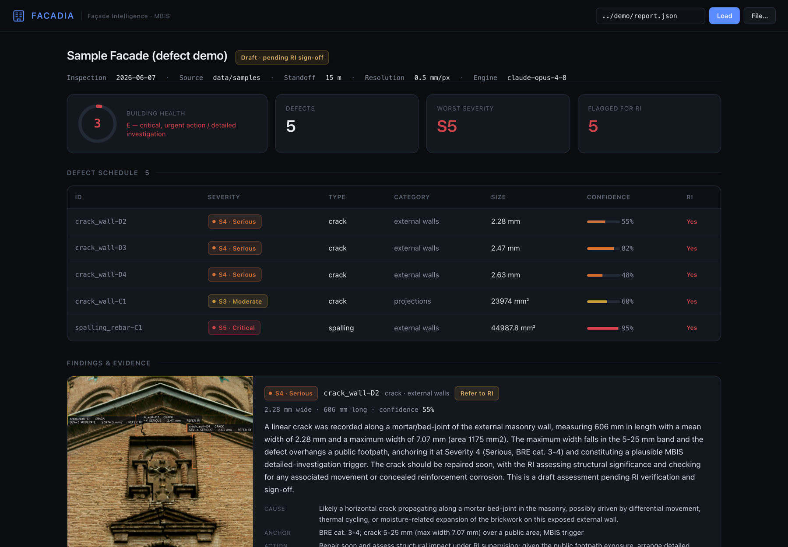
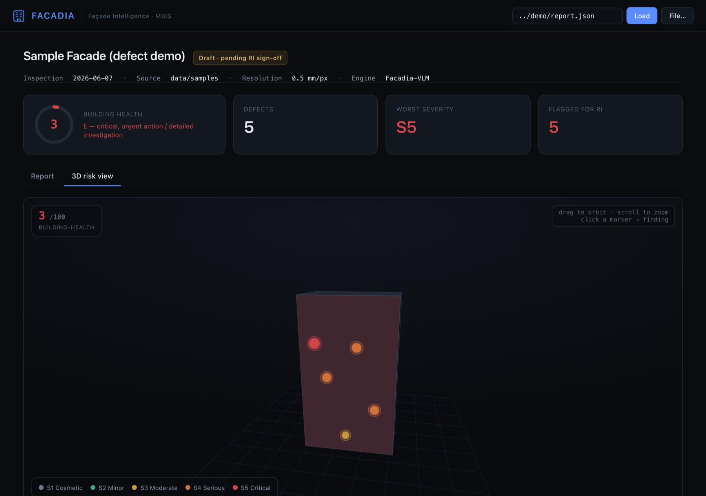

<div align="center">

# Facadia

**The AI building surveyor.** It reads a façade from ordinary drone footage, grades
every defect, and drafts the legally required inspection report.

[](https://github.com/danielshx/Hawkeye/actions/workflows/ci.yml)
[](LICENSE)




<sub>Report view: defect schedule, severity, measurements, drafted MBIS findings.</sub>



<sub>3D risk view: defects mapped onto the building, orbit and zoom. Placement is illustrative; see [HONESTY.md](HONESTY.md).</sub>

</div>

Facadia's vision-language model reads a building façade from ordinary drone footage.
It explains and grades every defect, drafts the legally required MBIS inspection
report, and a human Registered Inspector (RI) signs it off. Every inspection adds to
a building-health data layer that becomes a risk score for buildings, sold to
insurers, banks and government.

> EuroTech Hong Kong Hackathon, Munich 2026 (Smart City track).
> We sell to the licensed inspectors who are legally accountable, make them faster
> and lower their liability, and stay hardware-agnostic. They detect cracks; we write
> the inspection.

---

## Two modules

| | What it does | Runs on |
| --- | --- | --- |
| 🧠 **[`survey/`](survey)** | The product. Façade frames go in, computer vision measures defects in mm, the Facadia VLM grades and explains them and drafts the MBIS report, and you get a health score plus a dashboard. | Mac / CPU |
| 🗺️ **[`recon3d/`](recon3d)** | The 3D layer. Drone video becomes a navigable 3D model (point cloud or Gaussian-splat fly-through). The live path implements [AnySplat](docs/anysplat.md) (arXiv:2505.23716). | NVIDIA GPU |

The hybrid is the IP. Classical computer vision is the ruler: precise, defensible
millimetre measurements. The Facadia VLM is the surveyor: it reasons about severity
and cause, writes the report, and handles defects no model was trained on. Severity
is grounded in real HK and BRE standards rather than invented. The full design is in
[ARCHITECTURE.md](ARCHITECTURE.md).

```
 drone footage  ->  detect + measure (CV, mm)  ->  Facadia-VLM grades it  ->  MBIS report + health score
                    the millimetres are handed to the model as fact          a Registered Inspector signs it
```

---

## Quickstart: the surveyor (Mac, CPU)

```bash
cd survey
echo 'FACADIA_API_KEY=...' > .env                    # gitignored
uv run python run.py --images-dir data/samples --out demo --gsd 0.5
python -m http.server 8000     # open http://localhost:8000/dashboard/
```

A committed showcase already lives in `survey/demo/`. Clone the repo, open
`survey/dashboard/`, and you get a real graded inspection (a structural crack rated
Serious, spalling with exposed corroding rebar rated Critical, building-health
3/100) in the console shown above.

The 3D layer needs a GPU. See [`recon3d/README.md`](recon3d/README.md).

---

## Does it actually measure? (accuracy)

The ruler is testable. `survey/eval/measure_accuracy.py` draws synthetic cracks of
known width and measures them:

| True width | Measured | Abs. error |
| ---: | ---: | ---: |
| 4 mm | 5.8 mm | 1.8 mm |
| 6 mm | 7.7 mm | 1.7 mm |
| 8 mm | 9.8 mm | 1.8 mm |
| 10 mm | 11.5 mm | 1.5 mm |
| 12 mm | 10.2 mm | 1.8 mm |

Mean absolute error is about 1.7 px, which is sub-millimetre at a typical close-range
drone GSD. Hairline cracks below roughly 3 px are the stated limit, and a zoom or
thermal pass is the roadmap fix (jury Q&A T6/T7). The model never invents a
measurement; the millimetres come from computer vision and are handed to it as fact.

---

## Engineering

- **Tested and linted in CI.** `pytest` covers the deterministic core (GSD, scoring,
  detection, report) and `ruff` runs on every push ([workflow](.github/workflows/ci.yml)).
  Locally: `cd survey && uv run --extra dev pytest`.
- **Structured output.** The VLM returns a schema-validated object, so the report is
  machine-checkable rather than free text.
- **CPU first.** The whole grading pipeline runs on a laptop, and only the reasoning
  model needs the network. It is reproducible with `uv` (`uv.lock` is committed).
- **Source-only repo.** Multi-GB drone videos are git-ignored; the demo ships as a
  small committed showcase.

## Roadmap

Today's hybrid (the CV ruler plus the Facadia VLM, with RI sign-off) is the starting
point. The asset that compounds is the data. Every signed inspection adds a
geo-located, time-stamped defect record to a city-scale façade-health dataset that no
incumbent has.

- **Facadia-VLM becomes a proprietary façade model.** Fine-tuned on that dataset
  (millions of labelled façade defects across materials, climates and ages), it moves
  from running on a frontier backbone to being our own model that detects, segments,
  measures and grades in a single pass, including defect types it has never seen.
- **From inspection to prediction.** With a time-series per building we can forecast
  how a defect will progress, for example that a spall will reach a falling-hazard
  state in about 18 months, which turns a 10-year statutory cycle into continuous
  monitoring.
- **A building-risk score.** That time-series becomes a per-building risk score served
  by API to insurers, banks, reinsurers and government. It is the venture-scale
  opportunity, and a data moat that grows with every façade we read.
- **Sensing.** Thermal and zoom passes to catch tile debonding and hairline cracks an
  RGB camera misses, plus on-device inference for live, on-site triage.

## Why Hong Kong, why now

Hong Kong is the densest, oldest-stock and most safety-pressured vertical city on
earth. It has a legal inspection mandate (MBIS requires buildings 30 years and older
to inspect external walls every 10 years, around 2,000 designated each year), a fatal
2025 façade fire, the end of bamboo scaffolding, a government opening its low-altitude
airspace, and an insurance industry next door that pays for building-risk data.
Manual inspection is slow, dangerous and subjective. Facadia collapses the surveyor
hours, not only the drone flight, and turns every inspection into part of a
city-scale risk dataset.

## Repo layout

```
Facadia/
├── survey/        # the AI building surveyor (defect grading + MBIS report)  (start here)
│   ├── core/      #   frames, gsd, detect, reason (VLM), score, report
│   ├── dashboard/ #   self-contained Palantir-style viewer
│   ├── eval/      #   measurement-accuracy harness
│   ├── tests/     #   pytest suite (CI)
│   └── demo/      #   committed showcase output
├── recon3d/       # 3D reconstruction (VGGT + Gaussian splatting; AnySplat live path)
├── docs/          # ARCHITECTURE, AnySplat write-up + paper, screenshots
├── ARCHITECTURE.md
└── CITATION.cff
```

## License

[MIT](LICENSE) for our code. Third-party models (VGGT, AnySplat, YOLO) and the sample
defect images keep their own licenses. See [`docs/anysplat.md`](docs/anysplat.md),
[`recon3d/README.md`](recon3d/README.md) and
[`survey/data/samples/ATTRIBUTION.md`](survey/data/samples/ATTRIBUTION.md).
